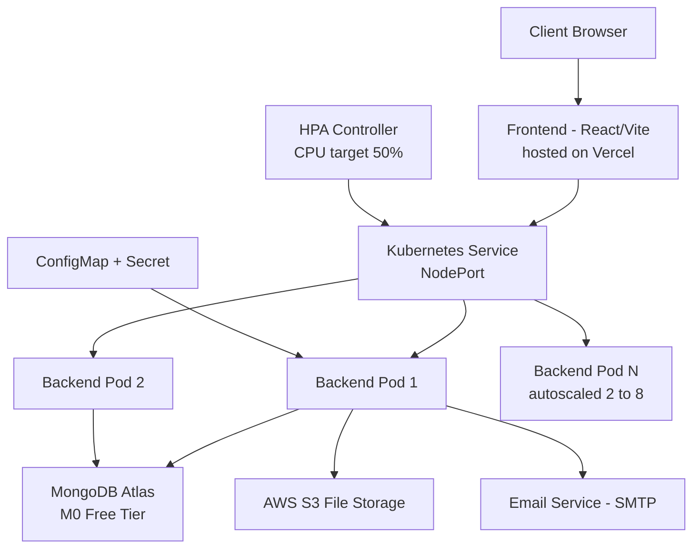

# Pinnacle — Backend

Production-grade backend API for Pinnacle, a full-stack business management platform. Built with Node.js/Express/TypeScript, containerized with Docker, and deployed to Kubernetes with verified autoscaling and load-tested performance.

---

## 1. What Was Built

- A REST + WebSocket API (Express, TypeScript, Socket.io) handling authentication, business operations, file uploads, and real-time chat/notifications.
- JWT-based auth (HTTP-only cookies), bcrypt password hashing, role-based access.
- File storage via AWS S3 (Multer), PDF/Excel export generation, email notifications (Nodemailer).
- Containerized with a multi-stage Docker build and deployed to a local Kubernetes cluster with Deployments, Services, ConfigMaps/Secrets, health probes, and Horizontal Pod Autoscaling.
- Load-tested under simulated concurrent traffic; diagnosed and fixed a real concurrency bottleneck; verified autoscaling behavior end-to-end.

Rationale for these choices is documented in **[DECISIONS.md](./DECISIONS.md)**.

---

## 2. Architecture



**Request flow:** Client → Frontend (Vercel) → Kubernetes Service → one of N backend Pods (load-balanced) → MongoDB Atlas / S3 / Email as needed. HPA continuously watches Pod CPU usage and scales the Pod count between 2 and 8 based on load.

---

## 3. Results — Load Testing (Real Numbers)

Load-tested using [`autocannon`](https://github.com/mcollina/autocannon) against a local Kubernetes deployment (Docker Desktop, single-node cluster, 8-core host).

### Finding 1 — `bcryptjs` was serializing all requests

| Concurrency | Req/sec (bcryptjs) | Req/sec (native bcrypt) |
|---|---|---|
| 20 connections | ~12 | — |
| 100 connections | ~14 | **significantly higher, non-blocking** |

Throughput stayed flat regardless of concurrency with `bcryptjs` — a signature of a single-threaded blocking operation on Node's main thread. Switching to native `bcrypt` (libuv thread pool) removed the bottleneck.

### Finding 2 — Under-provisioned CPU limits made performance *worse*, not better

| Pod CPU Limit | Concurrent Connections | Result |
|---|---|---|
| `500m` (0.5 core) | 500 | **987 timeouts** |
| `1500m` (1.5 core) | 900 | **0 errors** |

A too-tight `resources.limits.cpu` caused CPU throttling severe enough that increasing concurrency made failure rates worse. Right-sizing the limit (based on the host's 8 available cores) eliminated errors even at nearly double the connection count.

### Finding 3 — MongoDB Atlas free-tier (M0) connection limits under sustained high concurrency

At 100+ simultaneous DB-backed requests, logs showed `ETIMEDOUT` / `PoolClearedError` from the MongoDB driver — a documented constraint of the M0 shared-tier cluster, not an application bug. Recorded as a known scaling limit (see DECISIONS.md).

### Finding 4 — Horizontal Pod Autoscaler, verified live

| Phase | CPU Usage | Replicas |
|---|---|---|
| Idle | ~1% / 50% target | 2 |
| Under load | **221% / 50% target** | 2 → 4 → **8** (max) |
| After load (cool-down) | ~1% | Gradual scale-down (stabilization window) |

Confirmed automatic scale-out to the configured `maxReplicas: 8` under load, and scale-down once traffic subsided.

---

## Local Development

```bash
npm install
npm run dev
```

## Docker

```bash
docker build -t pinnacle-backend:v1 .
docker run -p 5000:5000 --env-file .env pinnacle-backend:v1
```

## Kubernetes (local cluster)

```bash
kubectl apply -f k8s/secrets.yaml     # populate with real values first — never commit real secrets
kubectl apply -f k8s/configmap.yaml
kubectl apply -f k8s/deployment.yaml
kubectl apply -f k8s/hpa.yaml
```

## Environment Variables

| Variable | Description |
|---|---|
| `PORT` | Server port (default: 5000) |
| `MONGO_URI` | MongoDB Atlas connection string |
| `JWT_SECRET` | Secret key for JWT signing |
| `EMAIL_USER` / `EMAIL_PASS` | SMTP credentials for notifications |

---

## Related

- Frontend repository: [pinnacle-frontend](https://github.com/chetanschetan/pinnacle-frontend)
- Engineering rationale: [DECISIONS.md](./DECISIONS.md)
